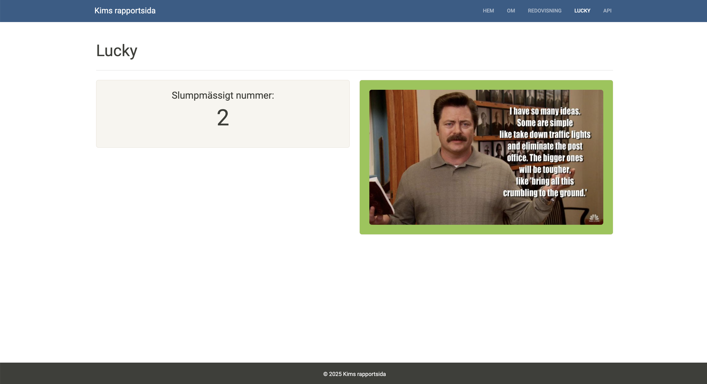

# Kims MVC-projekt med Symfony

Detta är ett projekt i kursen MVC på BTH. Siten är byggd med Symfony, Webpack Encore, Twig och Bootstrap. 

---

## Installera

### 1. Klona repot

```bash
git clone git@github.com:bistermister/mvc.git
cd mvc
```

### 2. Installera komponenter (förutsätter att php är installerat på en mac)
```bash
composer install
npm install
npm run watch
brew install symfony-cli/tap/symfony-cli
```

### 3. Starta miljön
```bash
symfony server:start
```
Gå till http://127.0.0.1:8000


